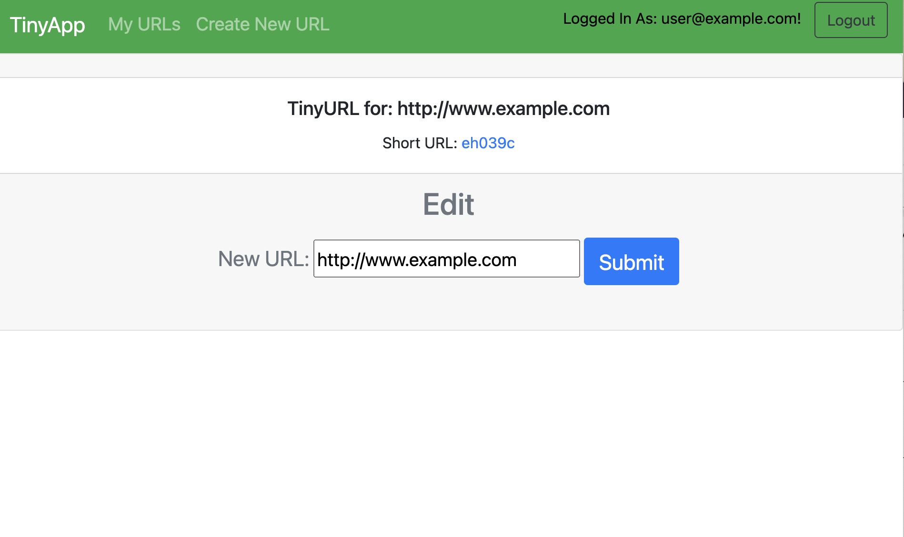

# TinyApp Project

TinyApp is a full stack web application built with Node and Express that allows users to shorten long URLs (à la bit.ly).
TinyApp is built with Node and Express.

## Final Product

Home Page Before Login

Main Page after login, displaying created links

Login Page

Registration Page

Specific short URL page created by the user

## Dependencies

- Node.js
- Express
- EJS
- bcrypt
- body-parser
- cookie-session

## Getting Started

- Install all dependencies (using the `npm install` command).
- Run the development web server using the `node express_server.js` command.
- Register as a new user.
- Start creating your own personal short URLs.
